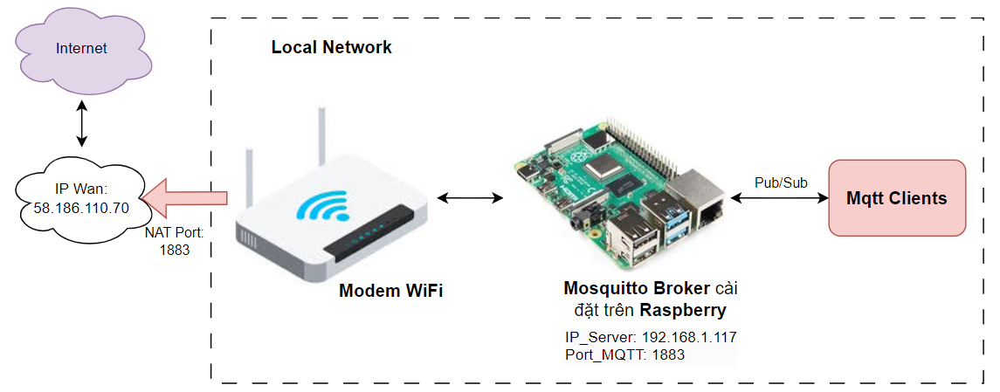
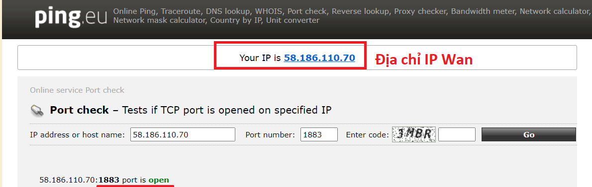
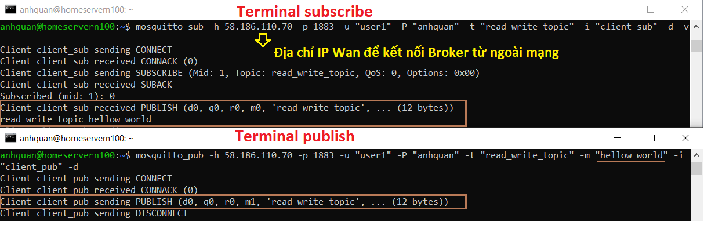
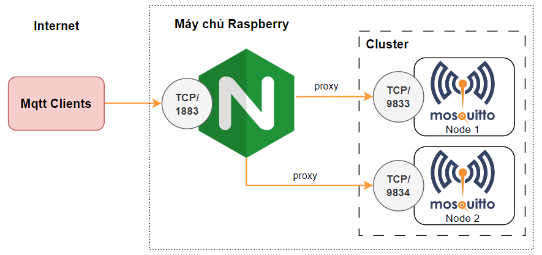
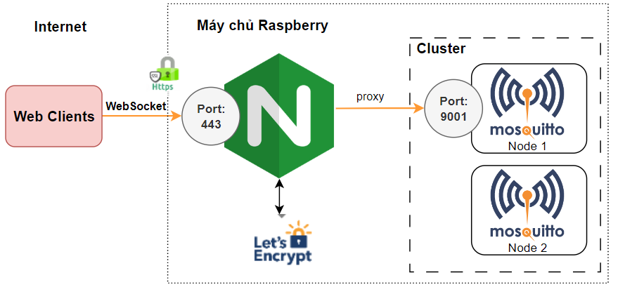
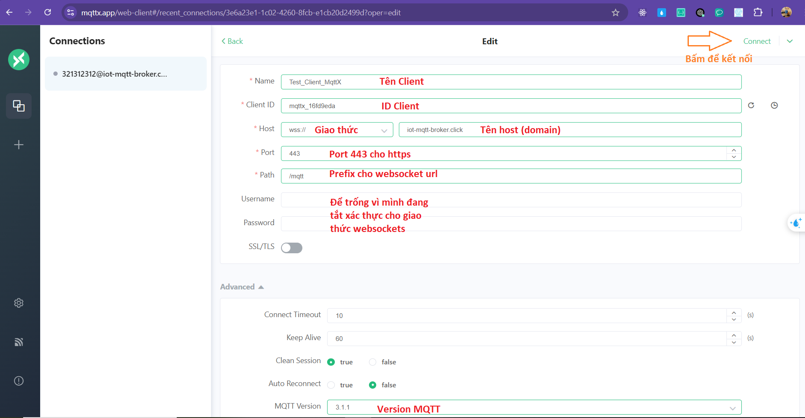

## 👋Giới thiệu

Ở các bài viết trước, mình đã chia sẻ tới các bạn cách xây dựng một Mosquitto Broker local ([phần 1](https://viblo.asia/p/trien-khai-mosquitto-broker-tren-ubuntu-server-2204-va-tich-hop-co-che-xac-thuc-uy-quyen-part-1-EbNVQwroJvR)) và tích hợp cơ chế xác thực uỷ quyền người dùng dựa trên Plugin mosquitto-go-auth ([phần 2](https://viblo.asia/p/tich-hop-co-che-xac-thuc-uy-quyen-cho-mosquitto-broker-su-dung-plugin-mosquitto-go-auth-va-mysql-part-2-7ymJXP7WJkq)). Bài viết này mình sẽ chia sẻ cách đưa máy chủ Mosquitto local lên internet.

## 🚀Cài đặt

### 1. Cấu hình các cổng kết nối

Mosquitto broker có thể kết nối qua **MQTT protocol** với cổng mặc định là **1883** và qua **WebSocket** với cổng **9001** để hỗ trợ các ứng dụng web.

Có thể nói:

- Cổng 1883 (MQTT - Message Queuing Telemetry Transport): chủ yếu được sử dụng cho các thiết bị IoT, hệ thống nhúng, và các ứng dụng không yêu cầu giao diện web.
- Cổng 9001 (WebSocket): cho phép các ứng dụng web-based (như dashboard IoT) kết nối với Mosquitto broker để theo dõi và giám sát các dữ liệu trong hệ thống.

Trong phần trước, mình đã cấu hình cho cổng 1883 trong file `default.conf`. Do đó, mình sẽ tạo thêm một file `websocket.conf` (cũng trong thư mục `/etc/mosquitto/conf.d`) để cấu hình cho cổng 9001. Để đơn giản mình sẽ tắt yêu cầu xác thực người dùng với cổng **9001**.

Cấu hình WebSocket trên cổng 9001 (ở đây mình chỉ chấp nhận kết nối từ máy chủ cục bộ):

```sh
listener 9001 127.0.0.1
protocol websockets
allow_anonymous true
```

Sau khi hoàn tất, bạn hãy chạy lại máy chủ Mosquitto:

```sh
sudo systemctl restart mosquitto.service
```

⚠️Các bạn lưu ý rằng, khi đặt tuỳ chọn `per_listener_settings true` trong file cơ sở `/etc/mosquitto/mosquitto.conf` thì cấu hình của mỗi cổng sẽ không xung đột lẫn nhau.

### 2. Đưa Mosquitto Broker từ local lên internet

- Nếu máy chủ Mosquitto broker có firewall, bạn cần mở cổng tương ứng:

```sh
sudo ufw allow 1883/tcp   # Mở cổng MQTT
sudo ufw allow 9001/tcp   # Mở cổng WebSocket (nếu cần)
```

- NAT Port:
  Các bạn hãy dùng thiết bị hỗ trợ trình duyệt đã kết nối sóng WiFi modem, để truy cập vào địa chỉ (**192.168.1.1**). Tuỳ theo modem nhà mạng, cách mở port (Port Forwarding) sẽ có giao diện khác nhau.



Nếu các bạn dùng nhà mạng fpt, các bạn có thể làm theo [hướng dẫn sau](https://cctvapp.net/2023/08/10/mo-port-nat-port-tren-modem-fpt-internet-hub-ac1000f/). Để Kiểm tra kết quả mở Port, bạn hãy truy cập trang [port-check](https://ping.eu/port-chk/)

👉️ Nếu kết quả hiển thị như bên dưới, bạn đã mở **Port 1883** thành công. Các bạn hãy ghi nhớ địa chỉ IP Wan để kết nối **Mosquitto Broker** từ internet nhé.



- 🗝️ Kiểm trả pub/sub tin nhắn thông qua mosquitto-clients:

Trong [phần 2](https://viblo.asia/p/tich-hop-co-che-xac-thuc-uy-quyen-cho-mosquitto-broker-su-dung-plugin-mosquitto-go-auth-va-mysql-part-2-7ymJXP7WJkq), mình đã tạo một người dùng có tên **"user1"** và cấp quyền đọc ghi với chủ đề **"read_write_topic"**. Mình sẽ thêm chỉ thị `-d` để hiện thị **debug message**. Các bạn có thể xem thêm các tuỳ chọn bằng cách sử dụng: `mosquitto_sub --help` và `mossquitto_pub --help`.



Như vậy, 😃chúng ta đã đưa thành công máy chủ Mosquitto Broker từ local ra internet để có thể truy cập từ ngoài mạng. Đối với cổng **9001**, các bạn cũng có thể NAT Port tương tự nhé. Tuy nhiên, phần này mình sẽ sử dụng **NGINX** làm proxy cho Mosquitto Broker qua **WebSocket**.

### 3. Sử dụng NGINX làm proxy cho Mosquitto Broker

- Đầu tiên, các bạn hãy [cài đặt Nginx](https://www.digitalocean.com/community/tutorials/how-to-install-nginx-on-ubuntu-22-04) trên cùng một máy chủ chạy Mosquitto Broker.

```sh
sudo ufw allow 'Nginx Full' # Đảm bảo mở tường lửa cho Nginx
```

- **_Cấu hình NGINX để chuyển tiếp kết nối TCP trên cổng 1883_**:

Nếu bạn muốn scale hệ thống lên thì **Nginx** rất hữu ích trong việc cân bằng tải khi cần chạy nhiều Mosquitto Broker khác nhau (mỗi broker sẽ chạy trên một container).



Mình sẽ cập nhập file `/etc/mosquitto/conf.d/default.conf` để Broker lắng nghe cổng **9883** và chỉ cần nhận các kết nối cục bộ.

```sh
listener 9883 127.0.0.1
protocol mqtt
```

**Tiếp theo**, thêm cấu hình Proxy TCP cho Nginx, các bạn thêm đoạn code sau vào cuối file `/etc/nginx/nginx.conf` (nếu trong file chưa có khối **stream**)

```sh
stream {
        server {
                listen 1883;
                proxy_pass 127.0.0.1:9883;
                tcp_nodelay on;
        }
}
```

Sau đó, các bạn hay kiểm tra file cấu hình có hợp lệ không và khởi động lại Nginx

```
sudo nginx -t
sudo systemctl restart nginx
```

Như vậy, chúng ta đã cấu hình thành công Nginx chuyển tiếp (proxy) các kết nối TCP đến một dịch vụ phía sau như Mosquitto Broker.

- **_Cấu hình NGINX để chuyển tiếp WebSocket_**:

Cho phép các ứng dụng web có thể kết nối trực tiếp với broker mà không cần phải thông qua một server trung gian khác.


Các bạn hãy tạo thêm file `/etc/nginx/sites-available/mosquitto-proxy.conf` để để thiết lập **NGINX** như một reverse proxy cho kết nối **WebSocket** đến Mosquitto.

Do đó thay vì mở cổng **9001**, các bạn chỉ cần NAT Port **80(HTTP)** và **443(HTTPS)**, nó giúp các bạn triển khai nhiều máy chủe Web khác không chỉ mỗi Mosquitto Broker.

```sh
server {
    listen 80;  # Cổng HTTP của NGINX
    server_name your-domain.com;  # Địa chỉ tên miền hoặc IP của bạn

    location /mqtt/ {
        proxy_pass http://localhost:9001/;  # Địa chỉ Mosquitto WebSocket
        proxy_http_version 1.1;
        proxy_set_header Upgrade $http_upgrade;
        proxy_set_header Connection "Upgrade";
        proxy_set_header Host $host;
        proxy_set_header X-Real-IP $remote_addr;
        proxy_set_header X-Forwarded-For $proxy_add_x_forwarded_for;
        proxy_set_header X-Forwarded-Proto $scheme;
    }
}
```

> ⚠️ Để nhớ dãy số địa chỉ IP Wan khá rắc rối, và đôi lúc mất điện hoặc nhà mạng reset sẽ khiến cho địa chỉ IP Wan nhà bạn bị thay đổi. Do đõ, các bạn nên sắm cho mình một **Domain** và trỏ bản record A về địa chỉ IP Wan nhà mạng.

😀 Mình thì mua tên miền từ [tenten.vn](tenten.vn) chỉ với 20k cho đuôi _io.vn_ hoặc _.click_. Trong bài viết này, mình sẽ demo với tên miền `iot-mqtt-broker.click`, các bạn hãy sửa giá trị `server_name` tương ứng với tên miền của bạn nhé.

🤝Mặc dù bài viét đã dài, các bạn cố gắng thêm một chút nữa nhé!!

Cài đặt SSL cho NGINX với Certbot.

```sh
# Tải Certboot
sudo apt install certbot python3-certbot-nginx
# Yêu cầu chứng chỉ SSL và tự động cấu hình cho NGINX bằng lệnh sau:
sudo certbot --nginx -d iot-mqtt-broker.click -d iot-mqtt-broker.click
# Kiểm tra cấu hình và khởi chạy lại Nginx
sudo nginx -t
sudo systemctl restart nginx
```

🏁 Như vậy, các bạn đã thêm chứng chỉ SSL cho Nginx và chuyển tiếp các yêu cầu HTTP sang HTTPS (chi tiết file cấu hình [mosquitto-proxy.conf](https://github.com/nhoc20170861/iot-mqtt-broker.click/blob/main/mosquitto-proxy.conf))

🥇 Hãy nghiệm thu lại các kết quả mình đã đạt được nhé. Các bạn có thể sử dụng [mqttx.app](https://mqttx.app/web-client) để tạo một Mqtt Client, các bạn hãy nhập thông tin máy chủ Mqtt của bạn và thử kết nối nhé ^^.



> ✨️Ngoài ra, các bạn có thể tham khảo thêm chương trình python để kiểm tra kết nối tới Mosquitto Broker qua WebSockets [tại đây nhé](https://github.com/nhoc20170861/iot-mqtt-broker.click/tree/main/python-mqttt).

### 4. Sử dụng CloudFlare (CF) để quản lý tên miền.

Hiện tại, với tên miền giá rẻ mình mua, Tenten chưa hỗ chỡ cấu hình Dynamic DNS. Do đó mình sẽ chuyển tên miền **iot-mqtt-broker.click** về CloudFlare quản lý và sử dụng API của CF để cập nhập **record A** khi địa chỉ IP Wan bị thay đổi. Các bạn làm theo các bước dưới đây nhé.

- [Trỏ Name servers về CloudFlare](https://help.tenten.vn/huong-dan-su-dung-cloudflare/): các bạn đặt nhớ chuyển **Proxy Status** sang **DNS only** nhé. (Vì tính năng TCP Proxied của CF cần trả phí, nên khi đó bạn sẽ không thể kết nối tới Mosquitto Broker qua cổng tcp/1883)
- [Cập nhật IP động cho tên miền qua CloudFlare](https://thuanbui.me/cap-nhat-ip-dong-cho-ten-mien-qua-cloudflare-de-truy-cap-homelab-tai-nha/)

  Các bạn có thể tham khảo mã `cloudflare_iot-mqtt-broker.sh` mình đã làm [tại đây](https://github.com/nhoc20170861/iot-mqtt-broker.click/tree/main/cloudflare_iot-mqtt-broker.sh) để tự động cập nhập địa chỉ IP Wan nha.

## 💡 Tổng kết

🤝Series này khá dài và nhiều kiến thức nâng cao, nên rất cảm kích các bạn đã dành thời gian để đọc bài viết của mình. Mình nhận thấy rằng kiến thức của mình còn nhiều hạn chết nên mình rất trân trọng nếu bạn có bất kì câu hỏi hay góp ý cho mình.

♥️ Một lần nữa mình xin cảm ơn các bạn đã dành thời gian theo dõi chuỗi bài viết của mình 😀

## 🔗 Nguồn tham khảo

- [1] [Cài đặt Nginx trên Ubuntu22.04](https://www.digitalocean.com/community/tutorials/how-to-install-nginx-on-ubuntu-22-04)
- [2] [Cài đặt bảo mặt Nginx vơi Let's Encrypt](https://www.digitalocean.com/community/tutorials/how-to-secure-nginx-with-let-s-encrypt-on-ubuntu-22-04)
- [3] [Định cấu hình NGINX cho websockets bảo mật mosquitto mqtt](https://iotassistant.io/home-assistant/install-mqtt-websockets-on-nginx/)
- [4] [Cấu hình Nginx cho TCP load Balancing](https://docs.nginx.com/nginx/admin-guide/load-balancer/tcp-udp-load-balancer/)
- [5] [Cập nhật IP động cho tên miền qua CloudFlare](https://thuanbui.me/cap-nhat-ip-dong-cho-ten-mien-qua-cloudflare-de-truy-cap-homelab-tai-nha)
